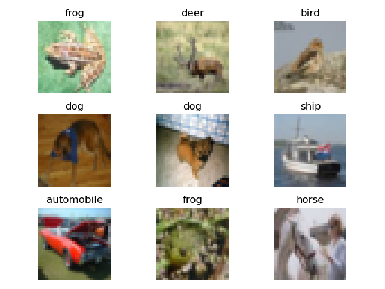

# Small Data Big Dreams
## Intro/Background

Data augmentation and transfer learning are vital for leveraging machine learning on small datasets. These techniques mitigate overfitting and improve model generalizability by artificially expanding the dataset and leveraging pre-existing knowledge, respectively. 

In this exploration, we'll delve into the application of these and similar methodologies for image classification and tabular regression problems on small datasets, presenting practical insights and challenges encountered in implementing these techniques.

## Problem Statement

The motivation of this project is to experiment with various dataset sizes and methodologies for data augmentation and transfer learning processes. Overfitting, limited dataset sizes, and overall accuracy in machine learning are still areas rife with potential for new development today, and the ability to artificially expand training sets from existing data offers an efficient breakthrough in the field. However, data augmentation today is still limited by the effectiveness of current approaches.

## Methods

We are going to explore different ways to deal with small datasets.

### Data augmentation:
Data augmentation methods, such as random croppings, rotations, and adding Gaussian noise, are ways to deal with small datasets. We will benchmark each data augmentation method as well as combinations of them to find the optimal combo.

### Generative models for data synthesis:
Synthetic data as a supplement to real data is another way to deal with small datasets. Specifically, we will test the GAN and Diffusion models on their efficacy in generating synthetic data.
- GAN: We’ll use GAN on existing datasets to generate synthetic data.
- Diffusion model: We’ll use textual inversion on pre-trained diffusion models to engineer a prompt for our dataset, and use this prompt as a condition to generate synthetic data from the pre-trained diffusion model. We will use TabDPPM as a our diffusion model for tabular regression [2, 5].
### Transfer learning: 
We’ll further explore how we can fine-tune existing large models for small dataset classification tasks.
- Changing all parameters of the model is probably unrealistic given our current devices.
- Use LoRA to fine-tune the classification model.
- Add layers on top of the pre-trained model and freeze other layers.
- Use of Big Transfer model for image classification [1].
## Potential Results/Discussion

We'll use several metrics to gauge the success of our data augmentation techniques. The Fowlkes-Mallows index gauges the similarity between synthetic and original data, with a higher score signaling better augmentation. The AUC-ROC, an evaluation measure for classification problems, plots the True Positive Rate against the False Positive Rate. We anticipate improved scores with synthetic data. For multi-class models, multiple AUC-ROC curves will be generated. In tabular regression tasks, we'll use RMSE and MAE, metrics that quantify prediction deviations from actual values, thus offering a holistic view of our prediction accuracy. We aim for these scores to also improve with the use of synthetic data [3, 4].
  After the use of data augmentation, we will utilize two main scoring metrics to determine the effectiveness of the synthetic data. First, the Fowlkess-Mallows Measure utilizes the following equation:

  We expect a score between 0 and 1 as well as the FM measure being higher for the data augmented set. 
  The second method that we will use is the “Area Under Curve” of the “Receiver Operating Characteristic” or AUC-ROC. This plots True Positive Rate (TPR) vs False Positive Rate (FPR) where:

  In the AUC-ROC curve, a higher value of X signifies more False positives than True negatives and a higher Y means more True positives than False negatives. The values of the AUC range from 0 to 1, where:
  - 0.7 - 0.8 is acceptable
  - 0.8 - 0.9 is excellent
  - 0.9+ is outstanding [3]

Similarly to the FM measure, we expect the AUC-ROC to be higher for the synthetic dataset. 
  
  When using the AUC-ROC for multi-class models with N number of classes, we will plot N number of AUC-ROC curves. For example, if there are three dog breeds (A, B, and C), then we will have 1 ROC for A classified against B and C, 1 ROC for B against A and C, and 1 ROC for C against A and B.

  
## Timeline:

## Contribution Table:

| Name            | Contribution                              |
|-----------------|-------------------------------------------|
| Gabe Graves     | Introduction and Background, Novel Methods |
| Lucy Xing       | Problem Statement                          |
| Hyuk Huang      | Results and Discussion                     |
| Hannah Lee      | Methods                                   |
| Rohan Nandakumar| Timeline, Github Page                      |

## References:
[1] A. Kolesnikov et al., “Big transfer (BIT): General Visual Representation Learning,” Computer Vision – ECCV 2020, pp. 491–507, 2020. doi:10.1007/978-3-030-58558-7_29  
[2] A. Kotelnikov, D. Baranchuk, I. Rubachev, and A. Babenko, TabDDPM: Modelling Tabular Data with Diffusion Models. doi: https://doi.org/10.48550/arXiv.2209.15421 Focus to learn more  
[3] J. N. Mandrekar, “Receiver operating characteristic curve in diagnostic test assessment,” Journal of Thoracic Oncology, vol. 5, no. 9, pp. 1315–1316, 2010. doi:10.1097/jto.0b013e3181ec173d  
[4] S. Narkhede, “Understanding AUC - roc curve,” Medium, https://towardsdatascience.com/understanding-auc-roc-curve-68b2303cc9c5 (accessed Jun. 16, 2023).   
[5] “Textual inversion,” Textual Inversion, https://huggingface.co/docs/diffusers/training/text_inversion#:~:text=Textual%20Inversion%20is%20a%20technique,model%20variants%20like%20Stable%20Diffusion (accessed Jun. 16, 2023).
